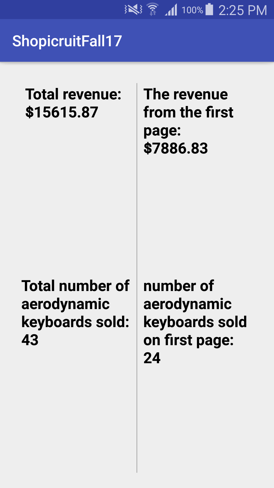

# ShopicruitFall17
A simple and elegant Android app made to show the number of Aerodynamic Cotton Keyboards and the total revenue of a Shopify Merchant.

### This app was made using:
* Native Android
* RxJava: because Observables are so nice
* Retrofit: IMO the nicest way to network on android
* Gson: Super easy JSON parsing in java

I didn't really understand why you said to only parse the first page 
(Why would there be multiple pages if you only wanted us to use one?) 
Just in case I misinterpreted the question, I also parsed all the pages using a beautiful recursive algorithm, and also showed for only one page.

